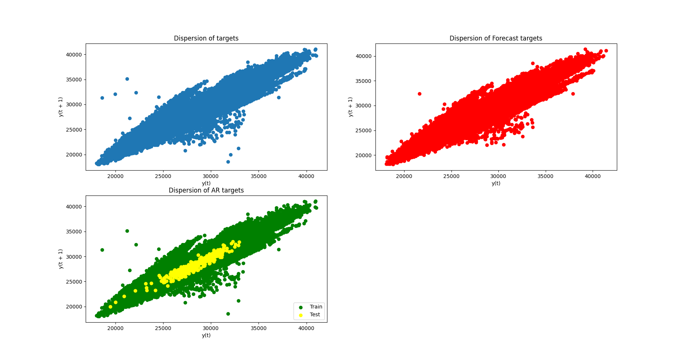

# Time series forecasting project

## How to run the code
All the code is on p1.py. It will read the TimeSeriesForecasting.csv file and clean it in order to make the following predictions.
The result will be plot and save in a .png file and a .csv dataframe.

Note ; The Random Forest model is long to execute.

## The use of SMA and EMA
SMA and EMA models are not fitting well with data due to the dispersion of the datasets. By plotting the datas, we show that they're not following a logical variation apart from the oscillations

## The ARIMA model
The ARIMA model offer better results, therefore we don't use all the dataset and only focusing on targets that

## The Random Forest Models
The random forest models is fitting well, it use all the datasets (with features) and is competiting with the forectastedTargets (98,5% vs 98,9%)

## Model Evaluation
